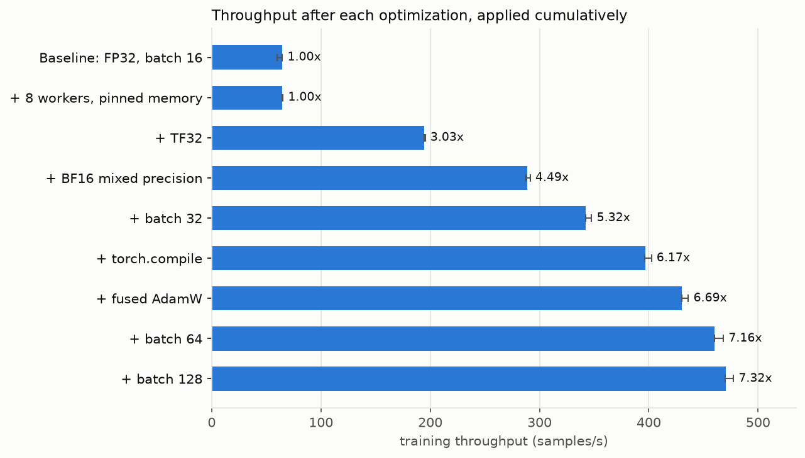
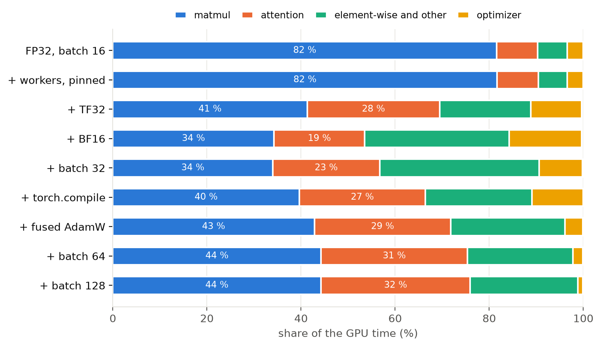
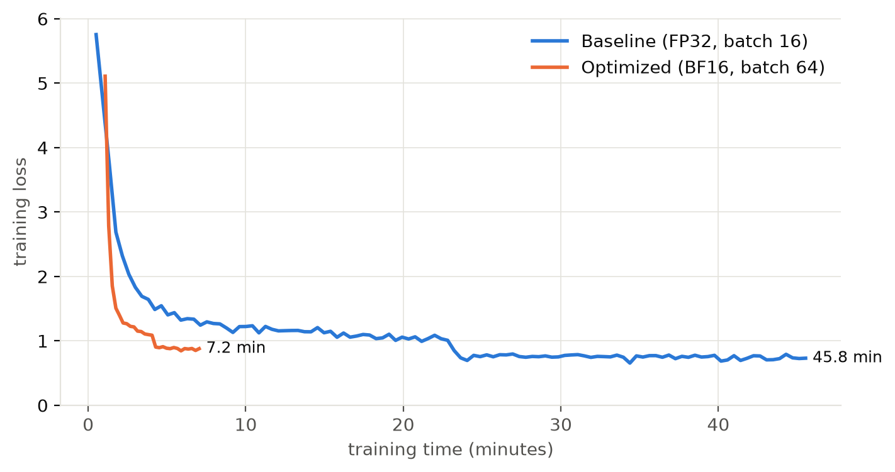

# Deliverable 1: BERT-base on SQuAD, single A100

We fine-tune BERT-base for question answering on SQuAD v1.1 on one A100 of FinisTerrae III,
measure the training time, and then apply the single-GPU optimizations of the course one at a
time, profiling each of them.

**Result:** two epochs take **45.8 min** in the FP32 baseline and **7.2 min** once optimized, a
**6.4x** speedup, at the cost of one point of F1 (87.97 to 86.97).

A PDF version of this report is in [`report/report.pdf`](report/report.pdf).

## 1. Setup

| | |
|---|---|
| Model | [`google-bert/bert-base-uncased`](https://huggingface.co/google-bert/bert-base-uncased), 109 M parameters |
| Data | SQuAD v1.1, 384-token windows with a 128-token stride: 88,492 training and 10,753 validation features |
| Training | 2 epochs, AdamW, learning rate 3e-5, 10 % linear warmup then linear decay |
| Hardware | 1 x A100-PCIE-40GB, 32 CPU cores (FT3 `short` QoS) |
| Software | PyTorch 2.11.0+cu128, Python 3.10.8, virtual environment in `$STORE` |

## 2. Files

| File | Purpose |
|---|---|
| `train_qa.py` | Training script: an explicit PyTorch loop in which every optimization is a flag |
| `prepare_data.sh` | CPU job that downloads the model and tokenizes SQuAD once |
| `run_improvements.sh` | Applies the optimizations cumulatively, 3 repetitions each, profiling the first |
| `run_baseline.sh`, `run_final.sh` | Full 2-epoch trainings, baseline and optimized, with F1 and exact match |
| `summarize.py`, `plots.py` | Table and figures of this report, from `results/*.json` |
| `results/`, `profiles/`, `figures/` | Raw measurements, `torch.profiler` traces and figures |

```bash
sbatch prepare_data.sh                                            # once
sbatch run_improvements.sh; sbatch run_baseline.sh; sbatch run_final.sh
python summarize.py results; python plots.py results
tensorboard --logdir profiles                                     # needs torch-tb-profiler
```

## 3. Method

- **Throughput** (samples/s) is measured over 100 steps after a warmup of 30 steps (60 with
  `torch.compile`), between two `torch.cuda.synchronize()` calls.
- Each configuration runs **3 times** in the same job; we report the **median** and the range.
- The **profiler** records 5 steps per configuration. We report the share of GPU time per kernel
  group, taken from the traces: shares are comparable across configurations, whereas absolute
  times are not, because the profiled steps are the first ones of each run.
- The baseline is **true FP32** (TF32 disabled). All batches have the same shape, so
  `torch.compile` never recompiles.
- Quality is measured with the official SQuAD metrics (**exact match and F1**) on the full
  validation set.

## 4. Deployment on FinisTerrae III

| Issue | Solution |
|---|---|
| The default PyTorch wheel targets CUDA 13, but the A100 driver (570.86.15) supports up to 12.8 | `pip install torch --index-url https://download.pytorch.org/whl/cu128` |
| `python/3.10.10` is not available | `module load cesga/2020 python/3.10.8`, in the venv and in every job |
| A GPU job with 4 cores is rejected: *«CPUs requested should be (nodes \* gpus/node \* 32)»* | Exactly 32 cores per A100 |
| `$HOME` quota is 20 GB | venv and Hugging Face cache (`HF_HOME`) in `$STORE` |
| Tokenizing inside the training job would count as training time | A separate CPU job tokenizes once and saves to `$STORE` |
| Long jobs queue longer | Every job requests less than 6 h, so it runs in the high-priority `short` QoS |

## 5. Results

### 5.1 One optimization at a time



| Step | Change | samples/s, median [range] | Speedup | Peak memory |
|---|---|---|---|---|
| 0 | Baseline: FP32, batch 16, no workers | 64.3 [60.0, 64.7] | 1.00x | 5.3 GB |
| 1 | + 8 workers, pinned memory | 64.4 [64.4, 65.2] | 1.00x | 5.3 GB |
| 2 | + TF32 | 194.6 [194.6, 195.4] | 3.03x | 5.3 GB |
| 3 | + BF16 mixed precision | 289.0 [287.5, 291.5] | 4.49x | 4.1 GB |
| 4 | + batch 32 | 342.2 [342.2, 347.7] | 5.32x | 6.6 GB |
| 5 | + `torch.compile` | 397.0 [396.1, 402.4] | 6.17x | 6.0 GB |
| 6 | + fused AdamW | 430.1 [430.0, 436.2] | 6.69x | 6.0 GB |
| 7 | + batch 64 | 460.2 [460.0, 468.3] | 7.16x | 10.4 GB |
| 8 | + batch 128 | 470.4 [470.2, 477.5] | 7.32x | 19.3 GB |

### 5.2 Where the GPU time goes



Memory copies stay below 0.5 % in every configuration.

### 5.3 Full training



| | Baseline (step 0) | Optimized (step 7) |
|---|---|---|
| Training time, 2 epochs | 2,747 s (45.8 min) | **431 s (7.2 min), 6.37x** |
| Mean throughput | 64.4 samples/s | 410.1 samples/s |
| Exact match / F1 | 80.34 / 87.97 | 79.13 / 86.97 |
| Peak memory | 5.3 GB | 10.4 GB |

## 6. Conclusions

- **The input pipeline was never the bottleneck.** The data is tokenized in advance and held in
  memory, so extra workers and pinned memory have nothing to hide (1.00x).
- **Precision is the decisive lever.** In FP32, 82 % of the GPU time goes to matrix products on
  the CUDA cores. TF32 moves them to the Tensor Cores without touching the model (3.0x), and BF16
  halves the data moved as well (4.5x). BF16 keeps the FP32 exponent range, so no loss scaling is
  needed.
- **Each optimization exposes the next bottleneck.** Once matrix products are fast, element-wise
  kernels and the optimizer weigh more: `torch.compile` fuses the former (+16 %), and fused AdamW
  cuts the optimizer from 11 % to 4 % of the GPU time (+8 %). Larger batches spread fixed
  per-step costs, with diminishing returns: batch 128 gains only 2 % over 64 for twice the
  memory, so the final run uses 64.
- **Attention is now the main cost (32 %).** PyTorch selects the memory-efficient attention
  kernel rather than FlashAttention, because BERT passes a padding mask; its backward pass alone
  takes 23 % of the GPU time. This is where the next gain would come from.
- **Time improves less than throughput** (6.4x against 7.3x). The optimized run spends about
  56 s outside the steady state, mostly compiling; this fixed cost weighs more in a 7-minute run
  than it would in a longer one.
- **Quality is preserved.** The baseline matches the published BERT-base figures (80.8 EM,
  88.5 F1). The optimized run loses about one point, plausibly because batch 64 makes four times
  fewer optimizer updates at the same learning rate; we did not tune it, as that is outside the
  scope of this deliverable.
- **Utilization.** The baseline reaches 67 % of the FP32 peak; the optimized run reaches 31 %
  of the BF16 peak, which is 16 times higher: 96 TFLOP/s against 13, counting 204 GFLOP per
  training sample (Kaplan et al., 2020).
